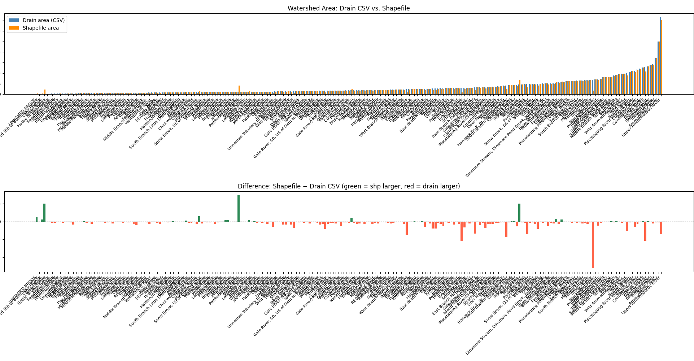

# NHDES Cold Water Wadeable Stream Modeling

## Project Narrative
This project develops a reproducible classification workflow for identifying cold-water, wadeable streams (1st through 4th order) in New Hampshire. The effort builds from the 2007 NHDES logistic regression study and evaluates whether updated preprocessing and model selection can improve predictive performance while preserving scientific interpretability.

The intended audience is agency scientists and future collaborators who need to understand procedure, assumptions, and outcomes well enough to reuse and extend the workflow.

## Current Status
- Maturity: model prototyping and development.
- Canonical entry point: `src/main.ipynb`.
- Current baseline: logistic regression.
- Planned model expansion: ridge regression, lasso, random forest, and decision tree.

## Research Questions
1. Can the original 2007 cold-water stream classification framework be reproduced with current data preparation steps?
2. Can predictive performance improve while maintaining clear interpretability for agency use?
3. Should the original species-count threshold (at least 30 SS/EBT) be retained, relaxed, or replaced based on cross-validated performance?
4. How sensitive are model outcomes to watershed area source and land disturbance threshold definitions?

## Reproducibility Quickstart

### 1) Environment setup
This repository currently does not include a locked dependency file. Start with the project virtual environment and install the core packages used by notebooks and utilities.

```powershell
python -m venv .venv
.\.venv\Scripts\Activate.ps1
pip install --upgrade pip
pip install pandas numpy matplotlib requests geopandas pynhd jupyter
```

### 2) Launch and run the main workflow
```powershell
jupyter notebook src/main.ipynb
```

Run cells in order from top to bottom.

### 3) Secondary exploratory workflow
```powershell
jupyter notebook docs/initial_exploration.ipynb
```

## Data Sources and Processing Logic

### NHDES EMD assemblage records
Primary electro-fishing fields used include:
- EMD station ID
- Collection date
- Stream order
- Latitude and longitude
- Fish species
- Number of fish collected

Original 2007 filter assumptions:
- 1st through 4th order streams only
- Valid latitude and longitude
- Focus on slimy sculpin (SS) and eastern brook trout (EBT)
- At least 30 SS and/or EBT observations

Current prototyping decisions under evaluation:
- Include strict warm-water specialists to increase useful contrast in labels
- Use cross validation to test whether sites with fewer than 30 SS/EBT can be retained
- Review ecological implications of potential deep-hole thermal refugia for wadeable stream interpretation

### Drainage area derivation
Two methods are being compared:
1. USGS NHD API using known COMID
2. NHDES watershed shapefiles with geospatial area calculation

Preliminary comparison indicates mean difference near 0.8 square miles between methods. Final selection criterion is still under evaluation.



### NLCD disturbance screening
The 2007 study excluded sites with significant human disturbance. This project re-estimates disturbance thresholds using NLCD by sampling year and evaluates threshold sensitivity with cross validation.

## Model Development Plan
- Baseline: logistic regression (aligned with prior study for comparability)
- Candidate expansions:
	- Ridge regression
	- Lasso
	- Random forest
	- Decision tree
- Evaluation approach (in progress): cross-validated comparison across model families and threshold definitions

## Repository Map

```text
nhdes-cw-stream-modeling/
|-- README.md
|-- docs/
|   |-- initial_exploration.ipynb
|   |-- Initial_Mtg.md
|   `-- static/
`-- src/
	|-- main.ipynb
	|-- data/
	|   |-- drain_to_waterbody.csv
	|   |-- watersheds_with_area_based-on-shp.csv
    |   |--20260316_Fish_Data.xlsx
	|   |-- Shapefiles/
	|   `-- NLCD tiffs/
	`-- utils/
		|-- compare_areas.py
		|-- drainage.py
		`-- geo_look.py
```

## Where To Start
- Primary workflow notebook: `src/main.ipynb`
- Early exploration notebook: `docs/initial_exploration.ipynb`
- Drainage API and watershed logic: `src/utils/drainage.py`

