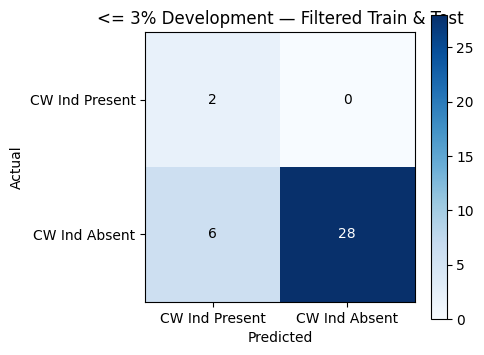
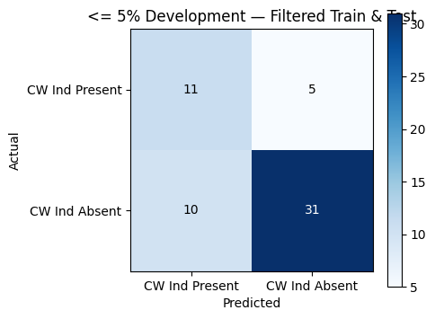
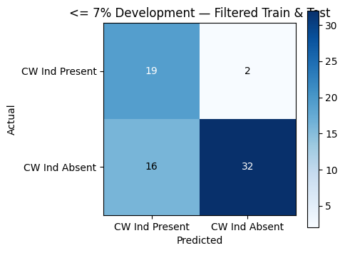
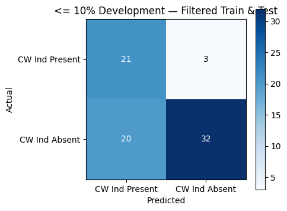
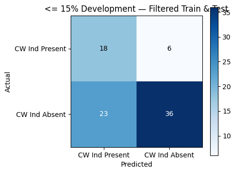
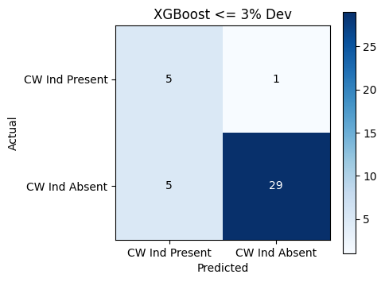
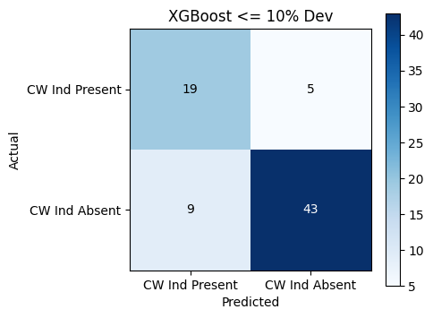
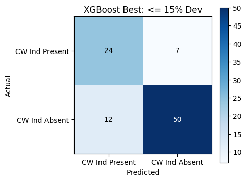

# Initial Exploration Results

## Data Preparation and Priors

There were 7 sites that we couldn't calculate a watershed area for (we're looking to fix) that were ignored for now. One site had a positive longitude that was fixed. 

Then, duplicate sites were merged (fish totals were added and extra sites were removed). That is sites with the same lattitude and longitude that were observed at different years (consistent with 2007 paper). So, the total population before modelling was 464 sites. 

The features modelled on are lattitude, longitude, and watershed area (calculated by the shapefile for each watershed that a site was inside). The target is cw_ind which is the encoding for each site that is 0 (Absent) or 1 (present) if *Slimy Sculpin + Brooke Trout >= 1* at that site. 

Additionally, to filter for % development a feature was added *pct_dev* that is calculated by adding the pixels coded as 21, 22, 23, or 24 in a site's watershed area divided by the total pixels. 

**Sites with Missing Watershed Data**

I93-POC-03_9_24, I93-POC-08_9_24, I93-POL-10_9_24, I93-POL-04_10_3, I93-POLU01-01_9_24, 04-BRL_7_14, 00P-POL_9_24

## Model Results

### Logistic Regression

5 Logistic regression models were fit to the data. Each model was fit on observations that were within a certain % development threshold (3, 5, 7, 10 , 15). 

**Logistic Regression 3%**

Observations kept (pct_dev <= 3%): 234 / 570
Train n=198, Test n=36

Accuracy: 0.83
Precision: 1.00
Recall: 0.82
F1 Score: 0.90

**Logistic Regression 5%**

Observations kept (pct_dev <= 5%): 285 / 464

Train n=228, Test n=57

Accuracy: 0.74
Precision: 0.86
Recall: 0.76
F1 Score: 0.81

**Logistic Regression 7%**

Observations kept (pct_dev <= 7%): 344 / 464

Train n=275, Test n=69

Accuracy: 0.74
Precision: 0.94
Recall: 0.67
F1 Score: 0.78

**Logistic Regression 10%**

Observations kept (pct_dev <= 10%): 377 / 464

Train n=301, Test n=76

Accuracy: 0.70
Precision: 0.91
Recall: 0.62
F1 Score: 0.74

**Logistic Regression 15%**

Observations kept (pct_dev <= 15%): 413 / 464

Train n=330, Test n=83

Accuracy: 0.65
Precision: 0.86
Recall: 0.61
F1 Score: 0.71

### XGBoost Ensemble Decision Trees

We also tried an XGBoost Decision Tree model which performed likely the best with pct_dev <= 10% and 15%. 3% performed very well but is likely overfit and we'd need to validate it more (more features will help if we can get some more from streamstats etc also we can cross validate the best train/validation split).

**XGBoost 3%**

pct_dev <= 3% | train n=156, test n=40

AUC: 0.917

Accuracy: 0.85
Precision: 0.97
Recall: 0.85
F1 Score: 0.91

**XGBoost 10%**

pct_dev <= 10% |
train n=301, test n=76

AUC: 0.821

Accuracy: 0.82
Precision: 0.90
Recall: 0.83
F1 Score: 0.86

**XGBoost 15%**

pct_dev <= 15% | trained on n=330, tested on n=93 

AUC: 0.821

Accuracy: 0.80
Precision: 0.88
Recall: 0.81
F1 Score: 0.84

